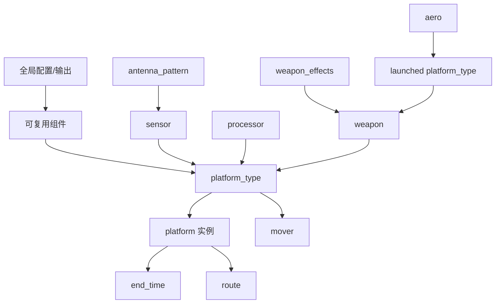
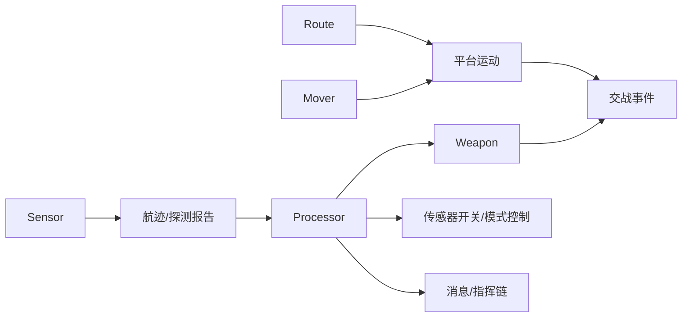

# AFSIM 组件关系分析文档

## 1. 文档目标

本文档面向“可验证的 AFSIM 场景自动生成”研究任务，梳理 AFSIM 脚本中的核心组件、依赖关系和场景组装流程，为后续 AFSIM-IR schema、Grounding 库、静态检查器和 benchmark 设计提供基础。

本文依据项目现有资料整理，包括：

- `references/file_structure.md`
- `references/commands_reference.md`
- `references/mover_reference.md`
- `references/sensor_types_reference.md`
- `references/script_api_reference.md`
- `references/common_mistakes.md`
- `references/script_syntax_critical.md`
- `references/examples.md`

## 2. AFSIM 场景的总体结构

AFSIM 场景脚本不是单一代码片段，而是由配置段、可复用组件、平台类型、平台实例和仿真控制命令共同组成。推荐结构如下：

1. 全局配置：`file_path`、`log_file`、`script_interface`、`event_output`、`dis_interface`
2. 可复用组件：`antenna_pattern`、`sensor`、`weapon`、`weapon_effects`、`aero`、`processor`
3. 平台类型：`platform_type ... end_platform_type`
4. 平台实例：`platform ... end_platform`
5. 仿真控制：`end_time`

这说明自然语言不能稳定地直接映射为完整脚本文本。更合理的生成链路应为：

```text
自然语言需求
-> Intent Parsing
-> AFSIM-IR
-> 组件 Grounding
-> 分层脚本生成
-> 静态验证
-> 执行验证与修复
```

## 3. 核心组件职责

### 3.1 Platform

Platform 是 AFSIM 场景中的实体实例或实体模板，可表示飞机、无人机、舰船、地面车辆、雷达站、导弹、卫星等对象。

平台有两层表达：

- `platform_type`：平台模板，定义通用能力和挂载组件。
- `platform`：平台实例，定义具体名称、阵营、位置、航线、组件开关和局部覆盖参数。

主要职责：

- 定义实体身份：名称、类型、阵营、图标、类别、空间域。
- 承载子组件：Mover、Sensor、Weapon、Processor、Comm。
- 提供物理属性：尺寸、质量、签名、生存能力。
- 建立指挥关系：`command_chain`、commander/subordinate 关系。
- 作为脚本 API 的中心对象：`PLATFORM.Sensor()`、`PLATFORM.Weapon()`、`PLATFORM.Processor()` 等。

生成约束：

- `platform_type` 和 `platform` 必须有对应结束标记。
- 平台实例引用的平台类型必须已经定义。
- 平台实例中的 sensor/weapon/processor 覆盖项必须引用平台类型中已有组件，或引用合法的全局组件定义。
- 阵营、坐标、高度、航向、速度等字段应在 IR 中显式表达，避免生成阶段猜测。

### 3.2 Mover

Mover 控制平台运动，是平台可移动性的核心组件。它通常嵌入在 `platform_type` 或 `platform` 中。

主要职责：

- 定义运动模型：空中、地面、水面、水下、导弹、空间、六自由度等。
- 约束速度、加速度、转弯能力、爬升/下潜能力和路径结束行为。
- 与 Route 共同决定平台轨迹。

常用类型：

| 场景 | 推荐 Mover |
|---|---|
| 固定翼飞机、无人机 | `WSF_AIR_MOVER` |
| 直升机、旋翼无人机 | `WSF_ROTORCRAFT_MOVER` |
| 地面车辆 | `WSF_GROUND_MOVER` |
| 舰船 | `WSF_SURFACE_MOVER` |
| 潜艇、鱼雷 | `WSF_SUBSURFACE_MOVER` |
| 制导导弹 | `WSF_GUIDED_MOVER` |
| 非制导炸弹/火箭 | `WSF_UNGUIDED_MOVER` |
| 卫星 | `WSF_SPACE_MOVER` / `WSF_NORAD_SPACE_MOVER` |
| 快速原型 | `WSF_KINEMATIC_MOVER` |

生成约束：

- Mover 参数必须与类型匹配。
- 所有数值型参数必须带单位。
- `WSF_AIR_MOVER` 不应使用资料中已标注不支持的 `default_climb_rate`、`default_descent_rate` 等参数。
- 路径结束行为应明确设置为 `extrapolate`、`stop` 或 `remove`，尤其在 benchmark 中要保证行为可解释。

### 3.3 Route

Route 描述平台运动路径，可内联于平台实例，也可定义为可复用路线。

主要职责：

- 定义航点序列。
- 指定航点位置、速度、高度/深度、航向、暂停时间等。
- 与 Mover 配合决定平台随时间的空间状态。

生成约束：

- 路线必须位于支持路线的移动平台上。
- 航点坐标格式必须合法，例如 `30.67n 104.07e` 或 `38:44:52.3n 90:21:36.4w`。
- 高度、速度、转弯、暂停等数值必须带单位。
- 不建议在 route 中使用易出错的 `loop`；若需要循环行为，优先使用 mover 的 `at_end_of_path` 或处理器逻辑。

### 3.4 Sensor

Sensor 表示平台的探测设备，可全局定义后挂载，也可直接嵌入平台类型中。

主要职责：

- 定义探测方式：主动雷达、ESM、EO/IR、声学等。
- 产生航迹或探测报告。
- 与 Processor 链接，驱动跟踪、信息分发或任务逻辑。

常用类型：

| 类型 | 作用 |
|---|---|
| `WSF_RADAR_SENSOR` | 主动雷达探测 |
| `WSF_ESM_SENSOR` | 被动电子支援/辐射源探测 |
| `WSF_EOIR_SENSOR` | 光电/红外探测 |
| `WSF_IRST_SENSOR` | 红外搜索跟踪 |
| `WSF_ACOUSTIC_SENSOR` | 声学探测 |

关键依赖：

- Radar 通常依赖 `antenna_pattern`、`transmitter`、`receiver`。
- Sensor 可通过 `processor <processor-name>` 连接 Track Processor 或脚本处理器。
- 平台实例可以控制 sensor `on` / `off`。

生成约束：

- 天线方向图参数必须放在 `constant_pattern` 子块中。
- 雷达脉冲宽度应使用科学计数法秒值，例如 `1.0e-6 sec`，不使用 `microsec`。
- Sensor 名称在平台内部必须可被 processor 或实例覆盖引用。
- 检测距离、视场、功率、频率、帧时间等必须使用正确单位。

### 3.5 Weapon

Weapon 表示平台挂载的武器或干扰设备。复杂武器可由 weapon、weapon_effects、被发射平台类型、mover、processor 等多组件组成。

主要职责：

- 定义武器库存、射程、发射间隔、制导方式和毁伤效果。
- 与 Processor/Launch Computer 配合执行交战逻辑。
- 通过脚本 API 支持 `Fire()`、`FireAtLocation()`、`CanIntercept()` 等动作。

常用类型：

| 类型 | 作用 |
|---|---|
| `WSF_AIR_TO_AIR_MISSILE` | 空空导弹 |
| `WSF_AIR_TO_GROUND_MISSILE` | 空地导弹 |
| `WSF_BOMB` | 炸弹 |
| `WSF_GUN` | 火炮/机炮 |
| `WSF_JAMMER` | 干扰设备 |
| `WSF_EXPLICIT_WEAPON` | 显式武器，常用于复杂发射平台建模 |

关键依赖：

- Weapon 可能引用被发射平台类型：`launched_platform_type`。
- Weapon 可能引用毁伤模型：`weapon_effects`。
- Weapon employment 通常依赖航迹、传感器、processor 和任务状态机。

生成约束：

- `quantity`、`maximum_range`、`minimum_range`、`firing_interval` 等字段必须合法。
- 武器名称必须与 Processor 中使用的 `PLATFORM.Weapon("...")` 一致。
- 复杂武器应分层生成：先 weapon_effects / aero / launched platform，再生成 weapon 挂载。

### 3.6 Processor

Processor 是行为、跟踪、任务状态机和脚本逻辑的主要承载组件。

主要职责：

- 处理传感器航迹。
- 执行任务状态机。
- 控制传感器、武器、通信和平台行为。
- 响应初始化、周期更新和消息事件。

常见类型：

| 类型 | 作用 |
|---|---|
| `WSF_SCRIPT_PROCESSOR` | 自定义脚本逻辑 |
| `WSF_TRACK_PROCESSOR` | 航迹处理 |
| `WSF_TASK_PROCESSOR` | 任务/状态机逻辑 |
| `WSF_GUIDANCE_COMPUTER` | 武器制导 |
| `WSF_GROUND_TARGET_FUSE` | 引信/毁伤触发 |

生成约束：

- `on_initialize` 和 `on_update` 中直接写代码，不使用 `script/end_script` 包裹。
- `on_message` 的 message handler 中才使用 `script/end_script`。
- 输出使用 `print()` 或 `writeln()`，不使用 C++ `cout`。
- 避免使用不支持的函数和运算符，如 `fmod`、三元运算符、强制类型转换、`%`。
- 只能使用已确认存在的 API 方法，避免幻觉方法如 `Position()`、`Geodetic()`、`Time()`。

### 3.7 Task

Task 在本项目中应优先理解为“任务语义层”，不是稳定的单一顶层脚本块。自然语言中的 CAP、巡逻、打击、侦察、压制、护航等任务，通常需要落地为多个 AFSIM 组件的组合。

任务语义通常由以下结构共同表达：

- Platform：执行任务的实体。
- Side：任务所属阵营。
- Route：巡逻区、航线、接近路线、撤离路线。
- Sensor：发现、跟踪、识别能力。
- Weapon：交战能力。
- Processor：任务状态机、交战规则、消息响应。
- Command chain / Comm：协同与指挥关系。
- Expected events：用于验证任务是否按意图发生。

因此，AFSIM-IR 中可以有 `tasks` 字段，但脚本生成时不应机械寻找单个 `task` 命令，而应把任务分解到 Route、Processor、Weapon、Sensor 和输出验证条件中。

## 4. 组件依赖关系

### 4.1 静态依赖



### 4.2 行为依赖



### 4.3 Grounding 依赖

自然语言概念不能直接落到脚本文本，必须经过 Grounding：

| 用户概念 | IR 字段 | Grounding 目标 | 脚本落点 |
|---|---|---|---|
| “两架战斗机” | `entities[].quantity=2` | 平台模板 | `platform_type` + 多个 `platform` |
| “蓝方” | `side=blue` | 阵营枚举 | `side blue` |
| “CAP巡逻” | `tasks[].type=cap` | 任务模式 | route + processor |
| “雷达搜索” | `sensors[].role=search_radar` | 传感器模板 | `sensor ... WSF_RADAR_SENSOR` |
| “发射空空导弹” | `weapons[].role=aam` | 武器模板 | `weapon` + processor fire logic |
| “巡逻区” | `locations[]` / `routes[]` | 坐标/区域 | route waypoints |

## 5. 场景组装流程

### 5.1 推荐生成顺序

1. 生成全局配置和输出配置。
2. 生成可复用物理/传感器/武器组件。
3. 生成平台类型。
4. 为平台类型挂载 mover、sensor、weapon、processor。
5. 生成平台实例。
6. 为平台实例设置 side、command chain、位置或 route。
7. 为平台实例设置 sensor/weapon/processor 开关和覆盖项。
8. 生成 `end_time`。
9. 执行静态验证。
10. 如可用，运行 `mission.exe` 并根据日志修复。

### 5.2 与 AFSIM-IR 的建议映射

AFSIM-IR v1 至少应覆盖：

- `scenario`: 场景名称、持续时间、输出需求。
- `sides`: 阵营定义。
- `entities`: 平台实例及数量。
- `platform_templates`: 平台模板或 Grounding 后的模板引用。
- `components`: sensor、weapon、mover、processor、comm 的抽象需求。
- `routes`: 航线、巡逻区、起终点、速度、高度。
- `tasks`: CAP、strike、ISR、patrol 等任务语义。
- `constraints`: 单位、坐标、时间、交战规则和安全约束。
- `expected_events`: 用于评测的预期事件。

## 6. 面向静态检查器的初步规则

Task-001 直接导出的检查规则如下：

| 检查项 | 说明 |
|---|---|
| 文件扩展名 | AFSIM 脚本应使用 `.txt` |
| 块闭合 | 检查 `platform`、`platform_type`、`mover`、`sensor`、`weapon`、`processor`、`route` 等是否有对应 `end_*` |
| 引用完整性 | 平台实例引用的平台类型必须存在；组件引用必须存在 |
| 单位完整性 | 速度、距离、时间、角度、功率、频率、质量等必须带单位 |
| 坐标格式 | 经纬度格式必须符合 AFSIM 支持形式 |
| Sensor 语法 | 天线方向图必须使用 `constant_pattern`；雷达脉冲宽度用秒 |
| Processor 语法 | `on_initialize`/`on_update` 不包裹 `script`；避免不支持 API 和运算符 |
| Weapon 一致性 | Processor 中武器名称与平台挂载武器名称一致 |
| Route 合法性 | route 中航点至少包含可解析位置，移动平台应有速度/高度约束 |
| 任务可验证性 | 每个任务应有对应的 route/processor/sensor/weapon 或 expected event 支撑 |

## 7. 对后续任务的影响

对 Task-006 AFSIM-IR v1：

- IR 应区分“任务语义”和“脚本组件”。
- Platform、Mover、Sensor、Weapon、Processor、Route 应作为一级结构或强类型子结构。
- Grounding 结果应记录来源，例如模板名、参考文件、置信度。

对 Task-002 benchmark：

- 样例任务应覆盖不同组件组合，而不只是不同文字描述。
- 至少包含：单平台移动、多平台对抗、传感器探测、武器交战、Processor 行为、协同通信。

对 Task-003 错误分类：

- 错误分类应同时覆盖语法错误、引用错误、组件不兼容、任务语义缺失和执行反馈错误。

对 Task-004/005 baseline：

- Direct Prompt 和 RAG Prompt 的评价不应只看“像不像脚本”，而要记录 IR 可恢复性、组件完整性、静态检查通过率和 mission.exe 可执行率。

## 8. 小结

AFSIM 场景生成的核心难点在于组件组合和约束一致性。Platform 是场景实体中心，Mover 决定运动能力，Route 描述轨迹，Sensor 产生探测与航迹，Weapon 提供交战能力，Processor 承载任务行为和闭环控制。自然语言中的 Task 不是单一脚本块，而是跨组件的任务语义，应在 IR 中显式表达，再分解到具体 AFSIM 组件。

因此，本项目后续应坚持：

```text
Intent -> AFSIM-IR -> Grounding -> Hierarchical Generation -> Verification -> Repair
```

而不是直接从自然语言生成完整 AFSIM 脚本。
